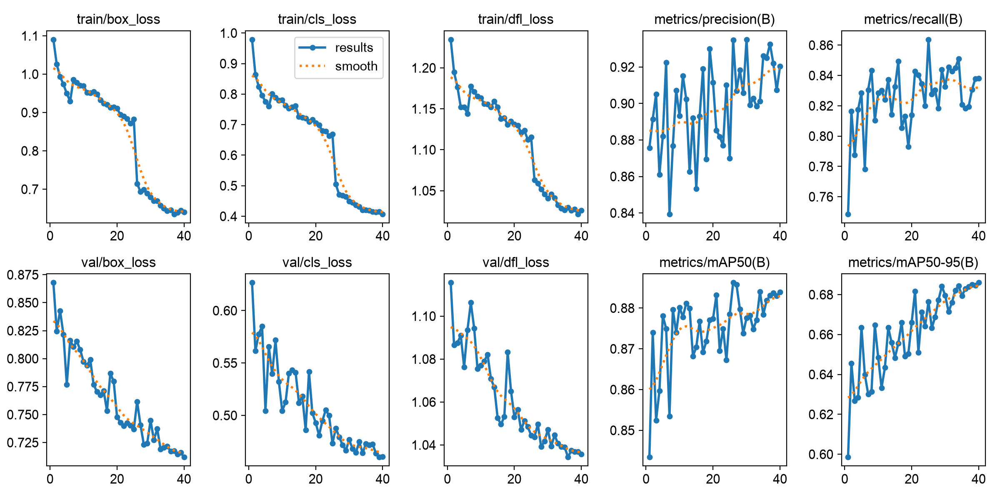
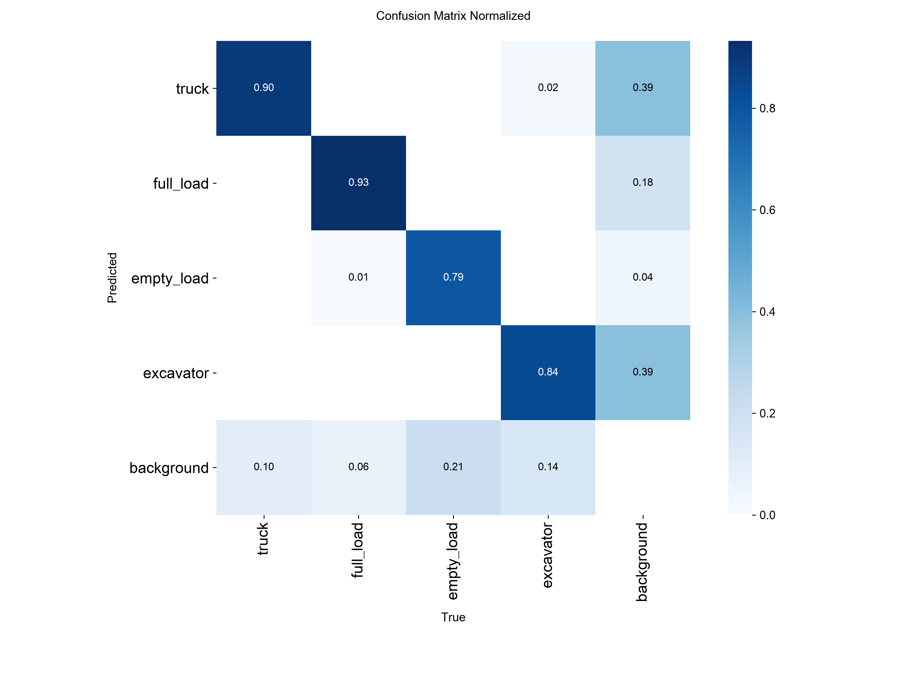
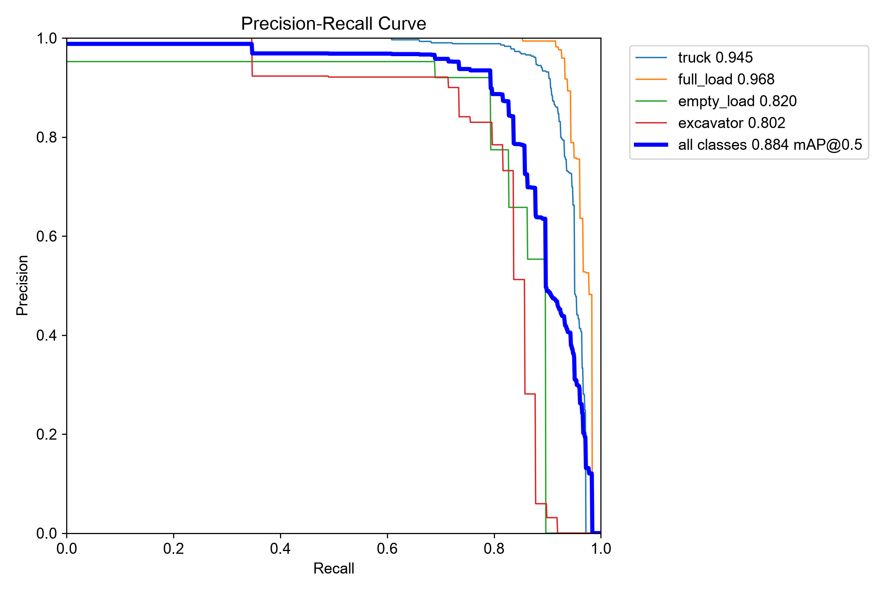
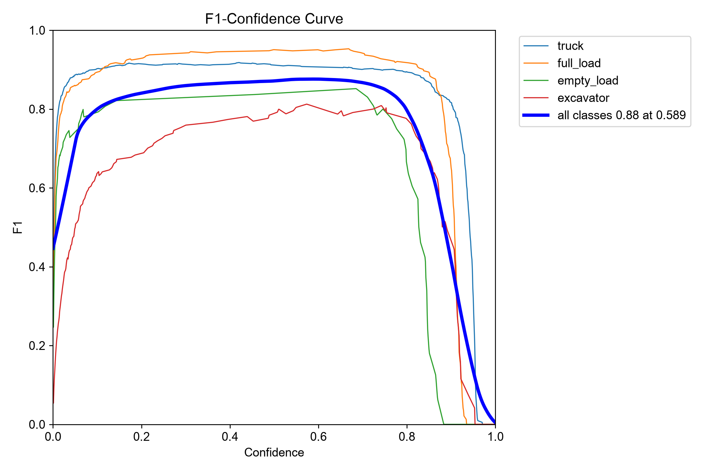
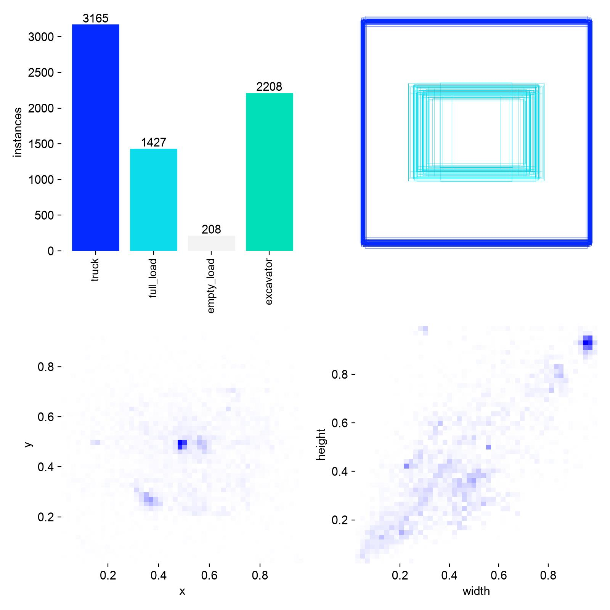
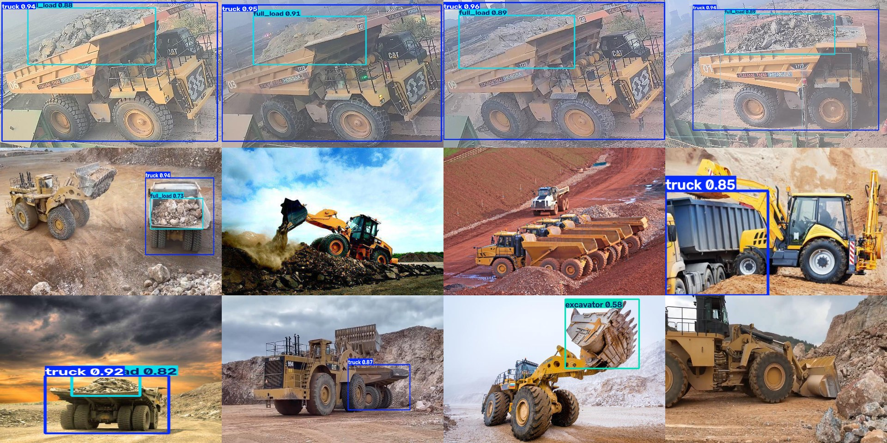

# Hasil training model v5

Grafik dan gambar pada halaman ini dihasilkan otomatis oleh Ultralytics saat melatih model v5
(4 class, 40 epoch, fine-tune dari model v4). File mentahnya ada di folder
[`hasil-training/`](hasil-training/).

## Ringkasan angka

Validasi (472 gambar):

| Class | P | R | mAP50 | mAP50-95 |
|---|---|---|---|---|
| truck | 0.968 | 0.854 | 0.945 | 0.820 |
| full_load | 0.981 | 0.921 | 0.968 | 0.733 |
| empty_load | 0.906 | 0.793 | 0.820 | 0.580 |
| excavator | 0.828 | 0.787 | 0.802 | 0.611 |
| **rata-rata** | **0.921** | **0.839** | **0.884** | **0.686** |

Test (187 gambar, tidak pernah dipakai saat training):

| Class | P | R | mAP50 | mAP50-95 |
|---|---|---|---|---|
| truck | 0.976 | 0.720 | 0.915 | 0.741 |
| full_load | 0.993 | 0.891 | 0.942 | 0.745 |
| empty_load | 0.957 | 0.857 | 0.855 | 0.721 |
| excavator | 0.906 | 0.789 | 0.851 | 0.659 |

## Kurva training

Enam grafik di sebelah kiri adalah error (loss): tiga di atas untuk data training, tiga di bawah untuk
data validasi. Semuanya turun sampai akhir, termasuk yang validasi, artinya model tidak overfitting.

Penurunan tajam di sekitar epoch 25 terjadi saat augmentasi mosaic dimatikan (`close_mosaic`, 15 epoch
terakhir) sehingga model belajar dari gambar utuh. Ini memang disengaja.

Empat grafik di sebelah kanan adalah metrik di data validasi. `mAP50` naik dari 0.84 ke 0.884 dan
`mAP50-95` ke 0.686. Precision dan recall naik-turun tiap epoch karena jumlah objek per class tidak
seimbang, tetapi trennya naik.

Angka per epoch tersedia di [`metrik-per-epoch-v5.csv`](hasil-training/metrik-per-epoch-v5.csv).

## Confusion matrix

Menunjukkan seberapa sering satu class tertukar dengan class lain. Kolom `background` berarti objek
tidak terdeteksi (untuk baris) atau deteksi pada area tanpa objek (untuk kolom).

## Kurva precision–recall dan F1

Kurva PR memuat nilai mAP50 tiap class. Kurva F1 membantu memilih ambang skor: puncak kurva adalah
ambang dengan keseimbangan terbaik antara presisi dan recall.

## Sebaran label

Jumlah objek per class serta sebaran posisi dan ukuran kotak di data training. Terlihat jelas bahwa
`empty_load` jauh lebih sedikit dibanding class lain — ini sebabnya class tersebut paling lemah.

## Contoh prediksi

Dua belas gambar dari test set (4 dari site asli, 8 dari dataset rf100), diproses dengan ambang 0.4.
Yang berhasil:

- Truk site asli terdeteksi 0.94–0.96, lengkap dengan `full_load` di baknya.
- Wheel loader (kanan bawah) dan truk jalan raya dibiarkan tanpa kotak — sesuai tujuan, karena bukan
  target deteksi.

Yang masih keliru, dan sengaja ditampilkan apa adanya:

- Bucket wheel loader pada gambar baris ketiga terdeteksi sebagai `excavator` (0.58).
- Barisan articulated dump truck pada gambar baris kedua tidak terdeteksi, karena ukurannya kecil dan
  bentuknya berbeda dari haul truck di data training.

## Catatan

Gambar contoh sengaja dibuat hanya dari test set, yang seluruhnya berasal dari dataset Roboflow
berlisensi CC BY 4.0. Gambar bawaan Ultralytics (`val_batch*.jpg`, `train_batch*.jpg`) tidak disertakan
karena memuat potongan frame video publik yang hak ciptanya dipegang pemilik masing-masing.
