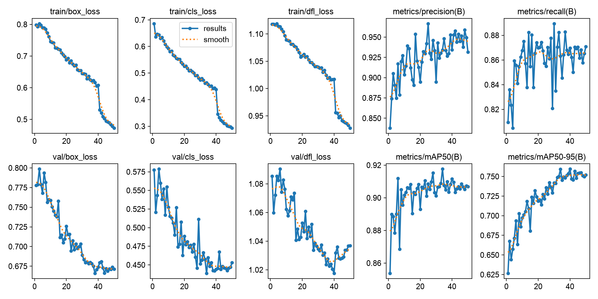
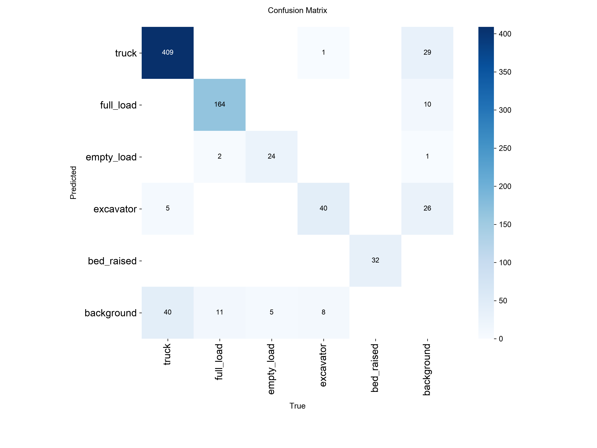
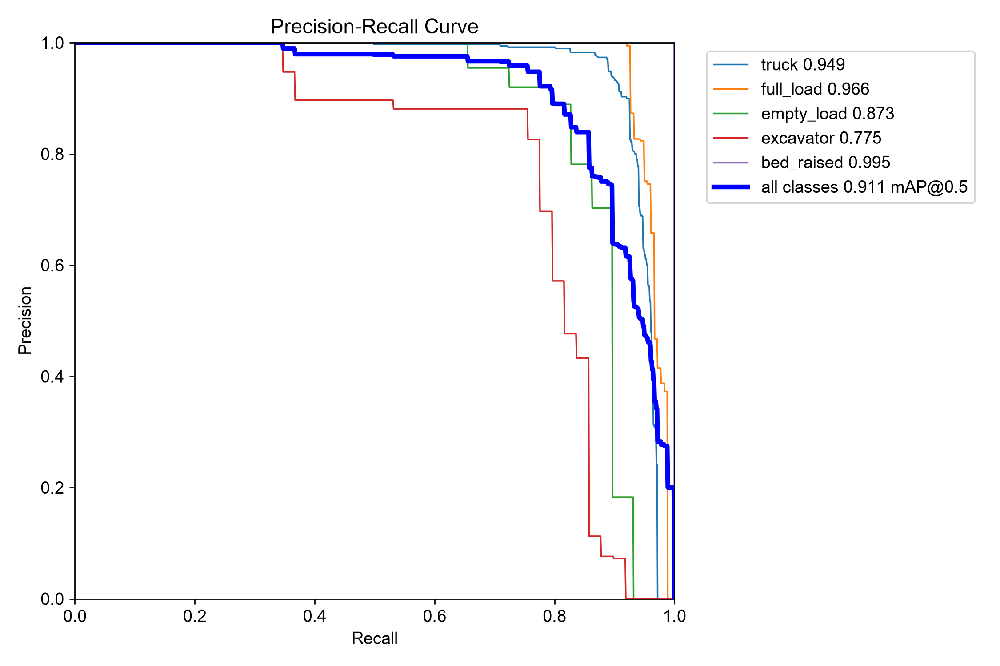
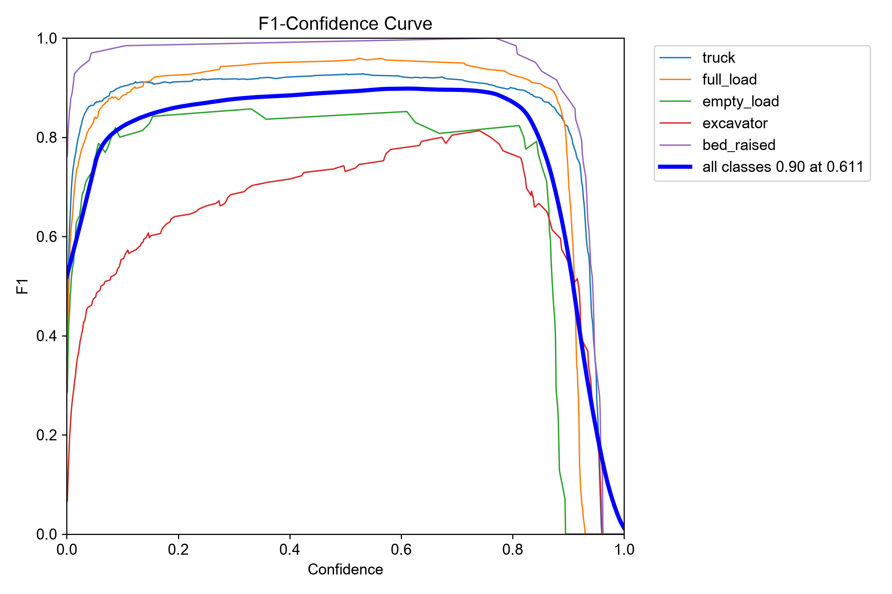
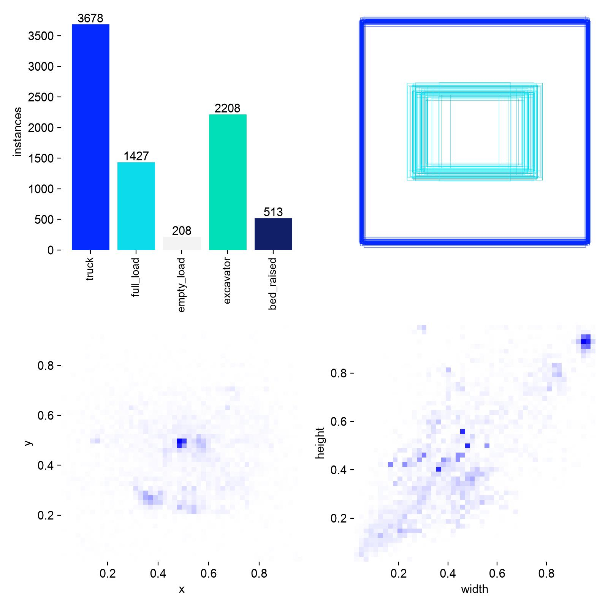
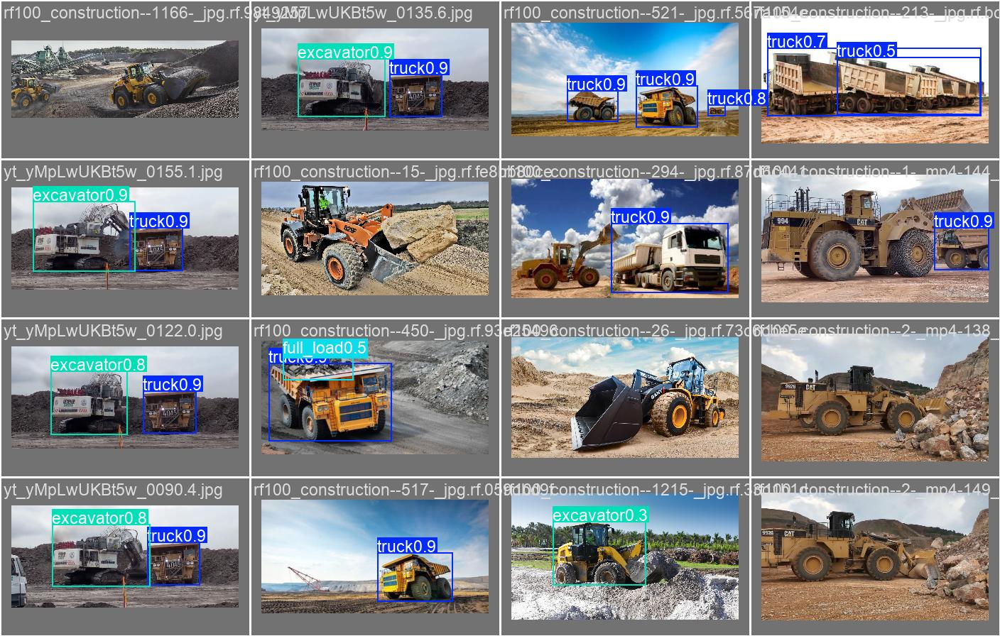

# Hasil training model v6

Grafik dan gambar pada halaman ini dihasilkan otomatis oleh Ultralytics saat melatih model v6
(5 class, 50 epoch, fine-tune dari model v5, selesai dalam 3,1 jam di M1 Pro). File mentahnya ada di
folder [`hasil-training/`](hasil-training/), termasuk berkas versi v5 untuk pembanding.

Dataset v6: 5.161 gambar latih, 504 validasi, 187 test. Jumlah kotak per class:

| Class | Kotak |
|---|---|
| truck | 4.303 |
| excavator | 2.276 |
| full_load | 1.650 |
| bed_raised | 545 |
| empty_load | 244 |

`bed_raised` berasal dari 203 frame pada 5 rekaman, digandakan 3× di split train agar tidak tenggelam.

## Ringkasan angka

Validasi (504 gambar):

| Class | P | R | mAP50 | mAP50-95 |
|---|---|---|---|---|
| truck | 0.973 | 0.874 | 0.949 | 0.832 |
| full_load | 1.000 | 0.912 | 0.966 | 0.746 |
| empty_load | 0.920 | 0.792 | 0.873 | 0.670 |
| excavator | 0.785 | 0.776 | 0.775 | 0.625 |
| bed_raised | 0.993 | 1.000 | 0.995 | 0.933 |
| **rata-rata** | | | **0.912** | **0.761** |

Angka `bed_raised` di tabel ini **terlalu optimistis**. Frame validasinya berasal dari rekaman yang
sama dengan frame latihnya, hanya beda detik, sehingga model sudah mengenal sudut dan latar yang
sama persis. Ukuran yang lebih jujur ada di bagian "Kemampuan pada rekaman dumping" di bawah.

Test (187 gambar, tidak pernah dipakai saat training, tidak memuat adegan dumping):

| Class | P | R | mAP50 | mAP50-95 |
|---|---|---|---|---|
| truck | 0.980 | 0.766 | 0.903 | 0.750 |
| full_load | 1.000 | 0.844 | 0.936 | 0.751 |
| empty_load | 0.902 | 0.857 | 0.855 | 0.728 |
| excavator | 0.887 | 0.824 | 0.850 | 0.697 |
| **rata-rata** | | | **0.886** | **0.731** |

## Perbandingan dengan v5

Pada test set yang sama persis:

| Class | v5 mAP50 | v6 mAP50 | Selisih |
|---|---|---|---|
| truck | 0.915 | 0.903 | −0,012 |
| full_load | 0.942 | 0.936 | −0,006 |
| empty_load | 0.855 | 0.855 | 0 |
| excavator | 0.851 | 0.850 | −0,001 |
| **gabungan** | **0.891** | **0.886** | **−0,005** |

Turun tipis, masih dalam rentang wajar untuk penambahan satu class. Sebagai gantinya recall naik —
lebih sedikit objek yang terlewat:

| Class | v5 recall | v6 recall |
|---|---|---|
| truck | 0.720 | **0.766** |
| excavator | 0.789 | **0.824** |
| empty_load | 0.857 | 0.857 |
| full_load | 0.891 | 0.844 |

Test set dipecah menurut asalnya, dengan jumlah instance apa adanya supaya angkanya tidak salah baca:

| Set uji | Isi | v5 | v6 |
|---|---|---|---|
| Site asli (43 gambar) | truck 43, full_load 37, empty_load 6 | 0.995 | 0.995 |
| Site asli versi malam sintetis | sama, digelapkan | 0.995 | 0.995 |
| Tambang lain / rf100 (144 gambar) | truck 128, excavator 19, full_load 9 | truck 0.871 | truck 0.856 |

Pada set tambang lain, class `empty_load` hanya punya **1 instance** dan `full_load` 9 instance,
sehingga angka keduanya tidak bisa dijadikan kesimpulan. Yang layak dibaca di set itu hanya `truck`
dan `excavator` (keduanya 0.851 di v5 maupun v6).

## Kemampuan pada rekaman dumping

Inilah alasan v6 dibuat. Diuji pada frame dumping dari lima rekaman:

| Rekaman | v5 kenali truk | v5 salah baca excavator | v6 kenali truk | v6 salah excavator | v6 bed_raised |
|---|---|---|---|---|---|
| Cat 793D waste dump | 0% | 37% | 100% | 0% | 100% |
| Nevada waste dump | 5% | 0% | 100% | 0% | 100% |
| Crusher feeder | 65% | 8% | 91% | 0% | 100% |
| Komatsu 930E | 100% | 4% | 100% | 0% | 100% |
| Tipper jalan raya | 79% | 4% | 100% | 0% | 100% |

Dua hal yang berubah sekaligus: bak terangkat kini dikenali, dan truk yang sedang menumpah tidak lagi
hilang atau salah dibaca sebagai excavator.

**Positif palsu nol.** Pada 187 gambar test dan 126 frame rekaman demo Frigate, `bed_raised` tidak
pernah muncul pada truk berbak normal.

**Generalisasi masih terbatas.** Dari 6 rekaman dumping yang tidak dilatih, hanya 1 yang terdeteksi
baik. Rekaman berdebu tebal, truk yang tertutup tepi timbunan, dan bak yang hanya terlihat sebagian
masih gagal.

## Kurva training

Loss turun mulus tanpa lonjakan, dan mAP naik sampai sekitar epoch 40 lalu mendatar. Karena fine-tune
dari v5, titik awalnya sudah tinggi — bukan mulai dari nol.

## Confusion matrix

Yang perlu diperhatikan: kolom `bed_raised` tidak lagi bocor ke `excavator`, kesalahan yang paling
mengganggu di v5. Sisa kebingungan terbesar ada antara objek dan latar belakang, bukan antar class.

## Kurva precision–recall dan F1

Kurva F1 dipakai memilih ambang kepercayaan. Nilai yang dipakai di Frigate — 0.45 untuk `truck`,
0.5 untuk class lain — diambil dari daerah puncak kurva ini.

## Sebaran label

Terlihat jelas ketimpangan jumlah: `truck` dan `excavator` jauh lebih banyak daripada `empty_load`
dan `bed_raised`. Itu sebabnya kedua class terakhir paling rentan dan paling perlu tambahan data.

## Contoh prediksi

Gambar dari batch validasi, kotak digambar oleh model sendiri.

## Catatan

- Seluruh angka diukur pada 320×320, ukuran yang sama dengan yang dipakai Frigate.
- Test set tidak memuat adegan dumping, jadi `bed_raised` tidak muncul di tabel test. Ukuran untuk
  class itu ada di bagian rekaman dumping.
- Perbandingan di halaman ini hanya antara v5 dan v6, karena keduanya diukur pada test set yang sama.
  Untuk perbandingan sampai v1, lihat tabel "Kemampuan v1–v6" di
  [`riwayat-model.md`](riwayat-model.md) — di situ kolom v6 diisi dengan mengukur ulang memakai bahan
  yang masih ada, dan baris yang setnya sudah terhapus diberi catatan tersendiri.
